<!-- META
title: Development Workflow
description: Development process, branch management, and best practices for CAIRA.
author: CAIRA Team
ms.date: 08/18/2025
ms.topic: guide
estimated_reading_time: 7
keywords:
    - development workflow
    - CAIRA
    - branches
    - best practices
    - commit conventions
    - automation
    - github
-->

# Development Workflow

This guide outlines the development process for contributing to CAIRA, including branch management, commit conventions, and development best practices.

## Prerequisites

Before you start developing, make sure you have:

1. **Contributing** - Read the [Contributing Considerations](../contributing/contributing_considerations.md)
1. **Development Environment** - Set up using our [Developer Guide](../developer.md)
1. **GitHub Account** - For forking and pull requests
1. **Git Configuration** - Configured with your name and email
1. **Issue Created** - All PRs must be linked to an issue

## Workflow Overview

```mermaid
flowchart TB
    subgraph row1 [" "]
        direction LR
        A["🎯 Create Issue<br/>Define requirements<br/>and scope"] --> B["🍴 Fork Repository<br/>Create your own<br/>copy to work on"]
        B --> C["📥 Clone Fork<br/>Download code<br/>to local machine"]
        C --> D["🌿 Create Branch<br/>Feature/fix branch<br/>from main"]
    end

    subgraph row2 [" "]
        direction LR
        E["✏️ Make Changes<br/>Implement your<br/>solution"] --> F["🧪 Run Tests<br/>Verify code quality<br/>and functionality"]
        F --> G["💾 Commit Changes<br/>Save progress with<br/>clear messages"]
        G --> H["⬆️ Push Branch<br/>Upload changes<br/>to your fork"]
        H --> I["🔄 Create PR<br/>Request merge<br/>to main repo"]
    end

    subgraph row3 [" "]
        direction LR
        J["👀 Code Review<br/>Maintainer feedback<br/>and approval"] --> K["🎉 Merge<br/>Integration into<br/>main branch"]
    end

    row1 --> row2
    row2 --> row3

    style row1 fill:none,stroke:none
    style row2 fill:none,stroke:none
    style row3 fill:none,stroke:none
```



## Fork and Clone

### Fork the Repository

1. Navigate to the [CAIRA repository](https://github.com/microsoft/CAIRA)
1. Click "Fork" in the top-right corner
1. Choose your GitHub account as the destination

### Clone Your Fork

```shell
# Clone your fork
git clone https://github.com/YOUR-USERNAME/CAIRA.git
cd CAIRA

# Add upstream remote
git remote add upstream https://github.com/microsoft/CAIRA.git

# Verify remotes
git remote -v
```

### Creating a Branch

```shell
# Ensure you're on main and up to date
git checkout main
git pull upstream main

# Create and switch to your feature branch
git checkout -b my-branch-name

# Push branch to your fork
git push -u origin my-branch-name
```

## Development Process

### Code Standards

Follow our coding standards:

- **Markdown** - Consistent formatting, spell-checked
- **YAML** - Proper indentation and structure

### Making Changes

1. **Follow existing patterns** - Look at similar implementations
1. **Write tests first** - Test-driven development preferred
1. **Update documentation** - Keep docs in sync with code
1. **Test locally** - Verify changes work before committing

### Running Tests and Linting

```shell
# Run all linting checks
task lint

# Run specific linters
task tf:lint
task md:lint

# Run tests
task test

# Run specific test
task test:acc:all
task test:int:all
```

## Commit Guidelines

### Signing Commits

All commits must be signed to verify the author's identity. Follow the [GitHub Docs: Managing commit signature verification](https://docs.github.com/en/authentication/managing-commit-signature-verification/) for instructions.

### Commit Message Format

Follow [Conventional Commits](https://www.conventionalcommits.org/) specification:

```text
<type>[optional scope]: <description>

[optional body]

[optional footer(s)]
```

### Commit Types

- `feat` - New feature
- `fix` - Bug fix
- `docs` - Documentation changes
- `style` - Code style changes (formatting, etc.)
- `refactor` - Code refactoring
- `perf` - Performance improvements
- `test` - Adding or updating tests
- `build` - Changes that affect the build system or external dependencies
- `ci` - CI/CD changes
- `chore` - Maintenance tasks
- `revert` - Revert a previous commit

### Examples

```text
# Feature commit
feat(azure-openai): add support for custom deployments

Add configuration options for custom model deployments
including temperature, max tokens, and frequency penalty.

Closes #123

# Bug fix commit
fix(networking): resolve subnet CIDR overlap validation

Fix validation logic that incorrectly flagged valid
non-overlapping CIDR blocks as conflicts.

Fixes #456

# Documentation commit
docs(contributing): update branch naming conventions

Clarify branch naming patterns and provide more examples
for different contribution types.

# Breaking change commit
feat(storage)!: change default encryption to customer-managed keys

BREAKING CHANGE: Default storage encryption now uses customer-managed
keys instead of Microsoft-managed keys. Existing deployments may need
to be updated.
```

### Commit Best Practices

- **Atomic commits** - One logical change per commit
- **Clear descriptions** - Explain what and why, not just what
- **Reference issues** - Use "Closes #123" or "Fixes #456"
- **Breaking changes** - Use "BREAKING CHANGE:" in footer
- **Keep it concise** - 50 characters for title, 72 for body lines

## 6. Testing Requirements

### Before Committing

Run the complete test suite:

```shell
# Lint all code
task lint
```

### Testing Requirements

- **Integration tests**: Major functionality must be tested
- **Documentation tests**: Examples must be validated

## 7. Pull Request Process

### Before Creating a PR

- [ ] All tests pass locally
- [ ] Code follows style guidelines
- [ ] Documentation is updated
- [ ] Commits follow conventional format
- [ ] Branch is up to date with main

### Creating the Pull Request

1. **Push your branch** to your fork
1. **Navigate to GitHub** and create a pull request
1. **Fill out the template** completely
1. **If there is already a related issue, link to it** using "Closes #123"

### PR Title Format

Use the same format as commit messages:

```text
feat(azure-openai): add support for custom deployments
fix(networking): resolve subnet CIDR overlap validation
docs(contributing): update development workflow guide
```

See our [Pull Request Guide](pull_request_guide.md) for detailed requirements.

## Code Review Process

### As an Author

- **Respond promptly** to review feedback
- **Ask questions** if feedback is unclear
- **Make requested changes** in new commits
- **Update the PR** when ready for re-review

### Review Timeline

- **Initial review**: Within 2-3 business days
- **Follow-up reviews**: Within 1-2 business days
- **Approval**: Requires 2 maintainer approvals
- **Merge**: Automated after all checks pass

See our [Code Review Guidelines](code_review_guidelines.md) for more details.

## Keeping Your Fork Updated

### Sync with Upstream

Regularly sync your fork with the upstream repository:

```shell
# Fetch upstream changes
git fetch upstream

# Switch to main branch
git checkout main

# Merge upstream changes
git merge upstream/main

# Push to your fork
git push origin main

# Update your feature branch (if needed)
git checkout my-branch-name
git rebase main
```

### Handling Conflicts

If your branch has conflicts with main:

```shell
# Fetch latest changes
git fetch upstream

# Rebase your branch
git checkout my-branch-name
git rebase upstream/main

# Resolve conflicts in your editor
# Then continue the rebase
git add .
git rebase --continue

# Force push to update your PR
git push --force-with-lease origin my-branch-name
```

## Common Development Tasks

### Adding a New Terraform Module

```shell
# Create module directory
mkdir -p modules/azure-new-service

# Create required files
touch modules/azure-new-service/{main.tf,variables.tf,outputs.tf,versions.tf,README.md}

# Create examples directory
mkdir -p modules/azure-new-service/examples/basic

# Follow our module template
```

## Getting Help

### Common Issues

- **Linting errors** - See [Linting Tools](linters.md)
- **Git problems** - Use GitHub Discussions for help

### Support Channels

- **GitHub Discussions** - General questions and help
- **Issue comments** - Specific to your contribution
- **PR reviews** - Direct feedback on your code
- **Documentation** - Check existing guides first

---

Ready to start developing? Create an issue to discuss your contribution, then follow this workflow to implement your changes!
